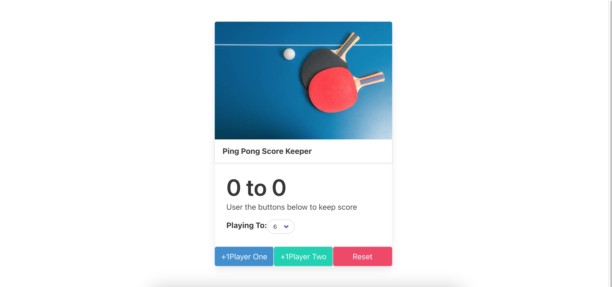
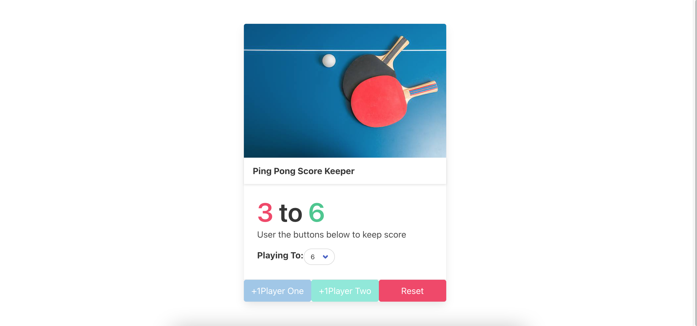

# Score Keeper Widget

Score Keeper is a simple widget that keeps score between two players in a game of ping pong.

## Final Product

Desktop View of Score Keeper Widget:

Desktop View of When Player 2 Wins:

## Getting Started

1. Install dependencies using the `npm install` command.
2. Start the web server using the `npm start` command. The app will be served at <http://localhost:8080/>.
3. Go to <http://localhost:8080/> in your browser.

## Dependencies

- Express
- Node.js